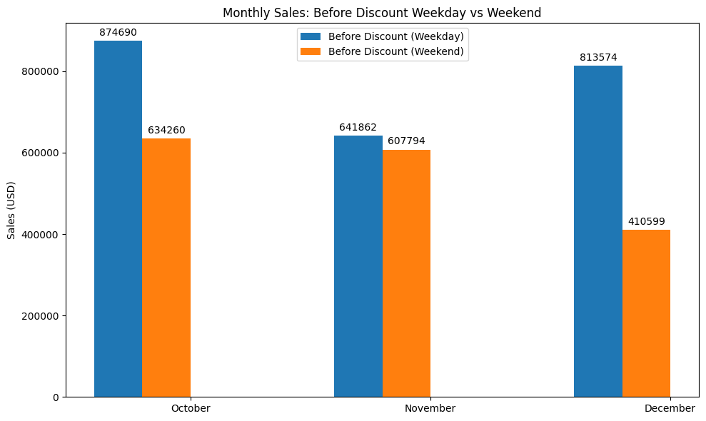
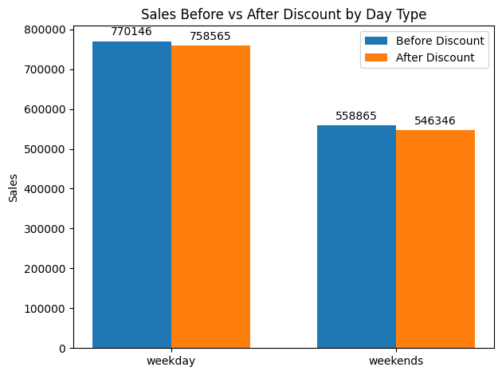

# Retail Analytics: Customer & Sales Insight Using Python + SQL

## Overview

This project analyzes a fictional retail company's sales data using a combination of **SQL queries (via pandasql)** and **Python tools (pandas, matplotlib, seaborn)**. The aim is to answer **business questions by data** and support **data-driven business decisions** by uncovering insights across **customer behavior**, **top and least product performance**, and **weekday vs weekend discount effectiveness through campaign period**.

The project was developed as part of the final capstone for a fullstack data analytics bootcamp.

---

## Business Questions Addressed

- what are top 5 Products from the Mobiles & Tablets Category during 2022, with the highest sales quantity?
- Which customers (Customer ID & registered date) who have checked out but have not made a payment during 2022?
  Note: This data is needed for promo information for customers at the end of this month.
- Is there an increase in sales in each of these campaign months?
  Note: Display average daily sales of weekends (Saturday and Sunday) vs. average daily sales of weekdays (Monday-Friday) per month. 
- Is there an increase in sales for the entire campaign months?
  Note: Display average daily sales of weekends (Saturday and Sunday) vs. average daily sales of weekdays (Monday-Friday) for the entire 3 months.
- During the campaign day (Saturday & Sunday) that ran from Oct 2022 to Dec 2022, does the campaign has sufficient impact on increasing sales?
  Provide accurate answer based on the data analysis performed by answering previous questions and structured recommendation for business problems.

---
## Provide explanation using data to check business preliminary assumption
### Assumption: Warehouse and marketing team assume that there has been a decrease in sales quantity in 2022 compared to 2021. 
- The assumption is started because the team found that the availability of product stock in the Others Category at the end of 2022 was still high
- To confirm this, I need to check the sales data for this category with the sales quantity in 2021 and I also tasked to display data for all 15 product categories
- If there is indeed a decrease in sales quantity in the Others category, I need to provide data on the top 20 product names that experienced the highest decrease in 2022 compared to 2021. This data is needed by the team as a discussion material at the next meeting.

---

## Key Insights

- Top 5 product all are mobiles & tablets category, which signify that mobile & tablets best performing category
- Analysing top performer based on category also return result that mobile & tablets gives the best sales performance
- Books and others product category are returning loss profit compared to other category by comparing their sales performance from 2021 - 2022
- Through this analysis, it is discovered there are 745 customers that have checked out but have not made a payment during 2022
- From the extracted and analyzed data, it was found that sales on weekdays were higher than weekends in Oct - Dec 2022
- The weekend campaign in Oct - Dec 2022 was not effective or had an impact on increasing sales

---

## Tools & Technologies

| Tool         | Purpose                      |
|--------------|------------------------------|
| Python       | Data processing & analysis   |
| Numpy        | Create data range            |
| Pandas       | Data manipulation            |
| Pandasql     | SQL queries on pandas DataFrames |
| Matplotlib & Seaborn | Data visualization |
| Google Colab | IDE for exploratory analysis |

---

## Project Structure
retail-sales-analysis-python-sql

├── Final_Project.ipynb
├── visuals/ (screenshots of data visualization)
├── README.md

---

## Charts & Visualizations

- Monthly Sales: Before Discount Weekday vs Weekend 
- Sales Before vs After Discount by Day Type 

---

## Skills Demonstrated

- Exploratory Data Analysis (EDA)
- SQL querying inside Python
- Generate list customer worth to give promo 
- Business storytelling through data
- Data visualization for decision-making

---

## Author

**Yuditya Artha**  
Data Analyst | SQL | Python | R | Power BI | Tableau  
[LinkedIn](https://www.linkedin.com/in/yuditya-artha) | [GitHub](https://github.com/yudityaartha)
